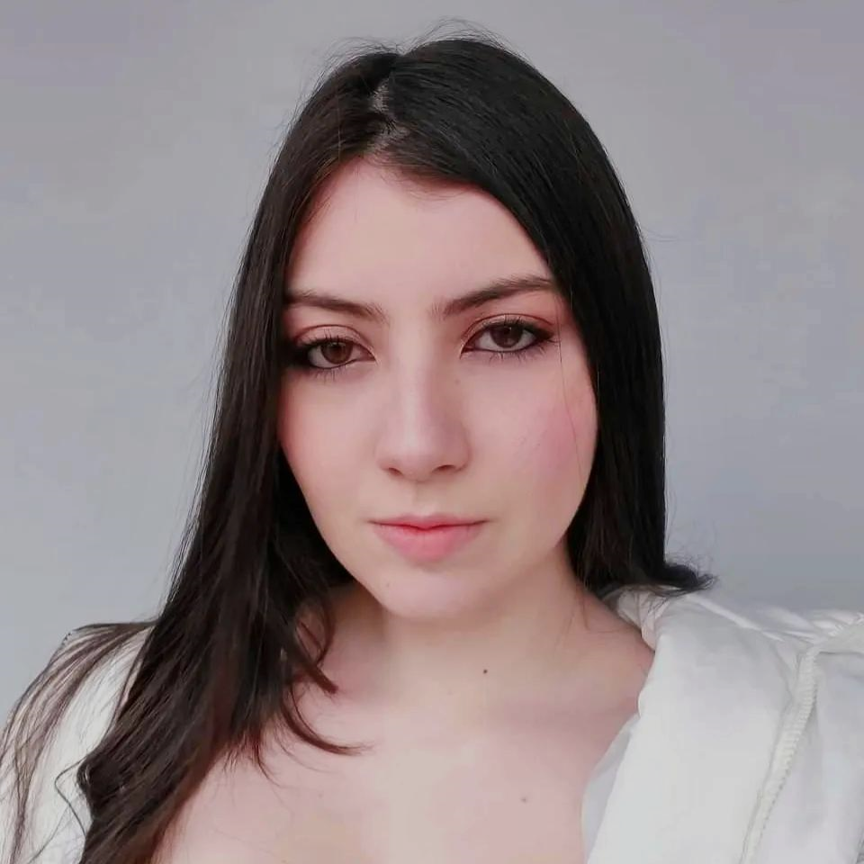

<h1 align="center"> Global Solution Python</h1>
<h2 align="center">Projeto com recursos para a melhoria da saúde voltado para idosos, crianças, PCDs e cuidadores👩‍⚕️</h2>
<h4 align="center">
	🚧   Concluído 🚀 🚧
</h4>

 <a href="#objetivo">Objetivo</a> •
 <a href="#funcionalidades">Funcionalidades</a> • 
 <a href="#executar">Como executar</a>• 
 <a href="#video">Video demonstrativo</a>•
 <a href="#desenvolvedores">Desenvolvedores</a> 

<h2 id="objetivo">💻 Sobre o projeto</h2>Contando com lembretes, notas importantes e até mesmo um botão para emergências, a ideia do projeto é dar mais controle e segurança tanto para os pacientes quanto para seus possíveis cuidadores.
	Além disso, visando também o público no geral, iremos incluir uma “área de triagem”, para facilitar a ida ao pronto-socorro dos pacientes e acelerar um pouco o processo, o que pode ser benéfico, também, para os próprios médicos. 
Este projeto faz parte da Global Solution , fornecida pela instituição FIAP.
 <h2 id="funcionalidades">⚙️ Funcionalidades</h2>

  
- [x] Ponto socorro/Pré triagem
- [x] Botão de emergência
- [x] Diário do paciente (notas, lembretes, lista de medicamentos e acesso às consultas marcadas)

<h2 id="executar">⚒️Como executar o programa</h2>
<h3>pré-requisitos</h3>
Antes de começar, você precisa ter instalado em sua máquina o GIT. Além disso você também precisa ter instalado algum programa que execute códigos em Python, como o PyCharm, Visual Studio Code, entre outros.
<h3>Como executar</h3>

1. Clone o projeto em sua máquina utilizando o comando `git clone` no terminal. 
2. Abra a pasta do projeto no seu ambiente de desenvolvimento. 
3. Execute a classe 'Main' para iniciar o programa.

<h2 id="video">🎬Video demonstrativo</h2>
Video demonstrando o software em execução, e explicando como o sistema aborda o problema.  
Link: https://youtu.be/CuZub2uYAeQ

<h2 id="desenvolvedores">👩‍💻Desenvolvedores</h2>
<table>
  <tr>
    <td align="center"> <b>Celeste Mayumi</b>  RM 552865</td>  
    <td align="center"> <b>Lívia Lopes</b>  RM 552558</td>
    <td align="center"> <b>Luana Vieira</b>  RM 552994</td>
   
  </tr>
</table>
